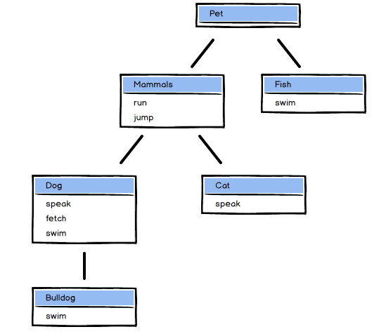

## 6: Polymorphism and Encapsulation ##

### Polymorphism ###

"**Polymorphism** refers to the ability of different object types to respond to the same method invocation, often, but not always, in different ways. In other words, data of different types can respond to a common interface" - Lesson 2:6

**Polymorphism through inheritance**

"polymorphism through inheritance -- instead of providing our own behavior for the ... method, we're using inheritance to acquire the behavior of a superclass"

"two different object types can respond to the same method call simply be **overriding** a method inherited from a superclass. In a sense, overriding methods like this is similar to duck-typing... However, overriding is generally treated as an aspect of inheritance, so this is polymorphism through inheritance" - 2:6

**Polymorphism through duck typing**

"**Duck typing** occurs when objects of different *unrelated* types both respond to the same method name. With duck typing, we aren't concerned with the class or type of an object, but we do care whether an object has a particular behavior. *If an object quacks like a duck, then we can treat it like a duck*" - Lesson 2:6


### Encapsulation ###

"Encapsulation lets us hide the internal representation of an object from the outside and only expose the methods and properties that users of the object need. We can use *method access control* to expose these properties and methods through the public (or external) interface of a class: its public methods." - 2:6

"always keep in mind that the class should have as few public methods as possible. It lets us simplify using that class and protect data from undesired changes from the outer world" - 2:6


"When a method is private, the method can only be invoked on `self` [rules about actually using literal `self` when calling a private method changed in Ruby 2.7. I *think* before that you could only use literal `self` to call private setter methods for purposes of disambiguation].  However, when a method is protected, instances of the class or subclass can also call the method. This means we can easily share sensitive data between instances of the same class type" - OOP Exercises, Accessor Methods: Who is Older?


## 9: Collaborator Objects ##

"Objects that are stored as state within another object are also called 'collaborator objects'. We call such objects collaborators because they work in conjunction (or in collaboration) with the class they are associated with." - RB120 2:9

"Collaborator objects play an important role in object oriented design, since they also represent the connections between various actors in your program. When working on an object orented program be sure to consider what collaborators your classes will have and if those associations make sense, both from a technical standpoint and in terms of modeling the problem your program aims to solve." - RB120 2:9

"**Collaboration** is a way of modeling relationships between different objects" - Wendy Kuhn

"**Inheritance** can be thought of as an *is-a* relationship. For example, a dictionary is a book" - WK

"**Association** can be thought of as a *has-a* relationship. For example, a library has books, so there is an associative relationship between objects of class Library and objects of class Book" - WK

"A collaborative relationship is a relationship of association - not of inheritance. Collaboration is a *has-a* relationship rather than an *is-a* relationship" - WC

* Collaborator objects can be of any type
* A collaborator object is part of another object's state.

"Collaboration doesn't just occur when code is executed and objects are occupying space in memory, but it exests from the design phase of your program." - WK

"With regard to actual objects in memory, *collaboration* occurs when one object is added to the state of another object (i.e., when a method is invoked on an object). However, a more helpful mental model is: *the collaborative relationship exists in the design (or intention) of our code*" - WK

So essentially, while a statically-typed language where you declare the fields of a class as objects of a certain type in advance, the principle remains the same for a dynamic language like Ruby; it is a *design* principle rather than purely a code structure like declaring a variable of a specific type in a class definition. In Ruby, from the point of code only, you need to rely on the names of variables to indicate in code the type of collaborator object tracked by an instance variable, for instance. However, when designing classes, even before naming variables, you should have an idea of the types of collaborator objects the class will need to have.

One thing Wendy Kuhn points out is that if you have a class like Library, here,

```ruby
class Library
  def initialize
    @books = []
  end
  
  def add_book(book)
    @books << book
  end
end

class Book
  def initialize(title, author)
    @title = title
    @author = author
  end
end

library = Library.new
trial = Book.new("The Trial", "Franz Kafka")
library.add_book(trial)
```

then the collaboration is between class Library and class Book, even though the object assigned to `@books` is an Array object, since the *meaningful* domain relationship you are modeling is a Library *having* Books; this is the thing to get right in the design process and the fact that the Book objects are stored in an array is more of an implementation detail than a meaningful part of the relationship between domain entities which is being modeled.


## Modules ##



"One of the limitations of class inheritance in Ruby is that a class can only directly sub-class from one super class. We call this <b>single inheritance</b>. In some situations, this limitation makes it very difficult to accurately model the problem domain. For example, suppose we have a new pat animal called `Fish`. The are pets that can swim, and have other characteristics like living in a small bowl, etc." - LS 2:10

"Some programming languages allow classes to directly inherit from multiple classes, a functionality known as <i>multiple inheritance</i>. Ruby's answer to multiple inheritance is by way of <i>mixing in</i> behaviors. A class can only sub-class from one parent, but it can mix in as many modules as it likes." - RB120 2:10

"The solution is to create a module, called <i>Swimmable</i>, and mix in that module in the appropriate classes."

```ruby
module Swimmable
  def swim
    "swimming!"
  end
end

class Dog
  include Swimmable
  # ... rest of class omitted
end

class Fish
  include Swimmable
  # ... rest of class omitted
end
```

## Coding Tips, 2:18

**spike** - "exploratory code to play around with the problem"

* Explore the problem before the design
* Repetitive nouns in method names is a sign that you're missing a class
* When naming methods, don't include the class name
* Avoid long method invocation chains
* Avoid design patterns for now - 'premature optimization is the root of all evil'

avoid optimizing for performance but also avoid attempting to anticipate what will be optimally flexible or maintainable for now (optimizing for best practices)

## CRC Cards ##

**Class Responsibility Collaborator** cards

Class name and superclass name (heading)

Responsibilities (lower left)

Collaborators / custom class objects tracking state of objects of this class (lower right)

CRC model - a collection of cards


1. Write a description of the problem and extract major nouns and verbs
2. Make an initial guess at organizing the verbs and nouns into methods and classes/modules, then do a **spike** to explore the problem with temporary code
3. When you have a better idea of the problem, model your thoughts into CRC cards

## ABC Size ##

Let a = assignments

b = branches (aka method calls)

c = conditions

`abc_size = Math.sqrt(a**2 + b**2 + c**2)`

If the resulting value is greater than 18 (by default), Rubocop flags the method as too complex